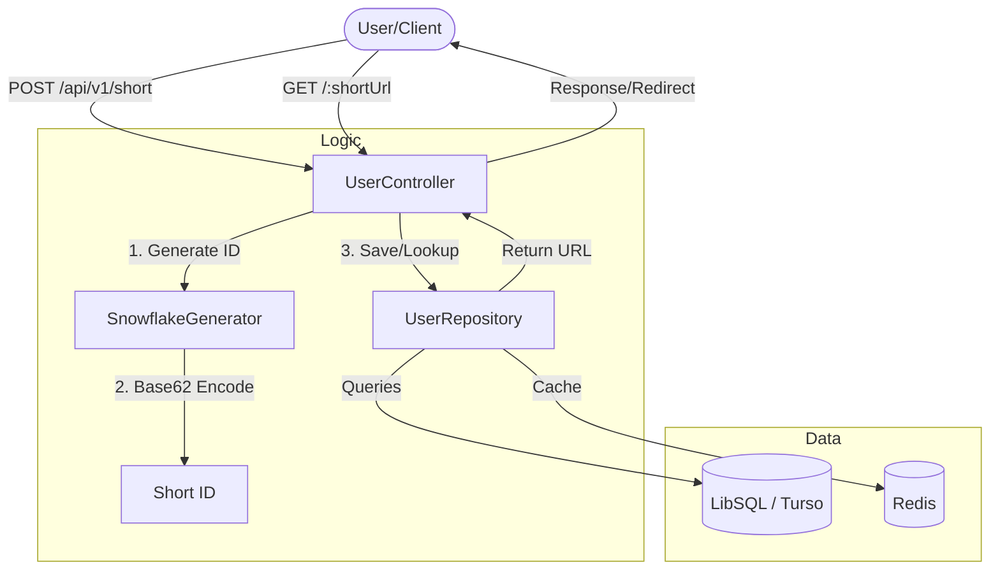

# 🔗 Shortener URL

A powerful and efficient URL shortener built with **Node.js**, **Express**, and **LibSQL (SQLite/Turso)**. It uses a custom **Snowflake ID** generator combined with **Base62** encoding to create unique, short, and scalable URLs.

---

## 🏗️ Architecture

The project follows a clean architecture pattern, separating concerns between controllers, repositories, and data sources.



---

## ❄️ Snowflake + Base62 ID Generation

To ensure unique and lexicographically sortable IDs without collisions, the system uses a **Snowflake** algorithm:

1.  **Timestamp**: 41+ bits (milliseconds since custom Epoch).
2.  **Machine ID**: 5 bits (allows up to 32 independent nodes).
3.  **Sequence**: 5 bits (allows up to 32 IDs per millisecond per node).

The resulting 64-bit integer is then encoded into **Base62** (`0-9`, `a-z`, `A-Z`) to produce the final short URL (e.g., `a7X2k`).

---

## 🚀 Getting Started

### Prerequisites
- Node.js (v18+)
- SQLite / Turso Account (Optional for local dev)
- Redis (Optional for rate limiting/caching)

### Installation
1.  Clone the repository:
    ```bash
    git clone https://github.com/Joel-RD/shortener-url.git
    cd shortener-url
    ```
2.  Install dependencies:
    ```bash
    npm install
    ```
3.  Configure environment variables:
    ```bash
    cp .env.example .env # Update with your database/port settings
    ```
4.  Run in development mode:
    ```bash
    npm run dev
    ```

---

## 📡 API Documentation

### 1. Shorten a URL
**Endpoint**: `POST /api/v1/short`  
**Body**:
```json
{
  "orig_url": "https://www.google.com"
}
```
**Response**:
```json
{
  "message": "URL acortada con éxito.",
  "url_acortada": "http://localhost:3000/a7X2k"
}
```

### 2. Redirect
**Endpoint**: `GET /:shortUrl`  
**Action**: Redirects the user to the original long URL.

---

## 🛠️ Tech Stack

- **Runtime**: [Node.js](https://nodejs.org/)
- **Framework**: [Express.js](https://expressjs.com/)
- **Database**: [LibSQL](https://github.com/tursodatabase/libsql-client-ts) (Turso/SQLite)
- **Caching**: [Redis](https://redis.io/)
- **ID Gen**: Custom Snowflake + Base62
- **Language**: [TypeScript](https://www.typescriptlang.org/)

---

## 📄 License
This project is licensed under the ISC License.
