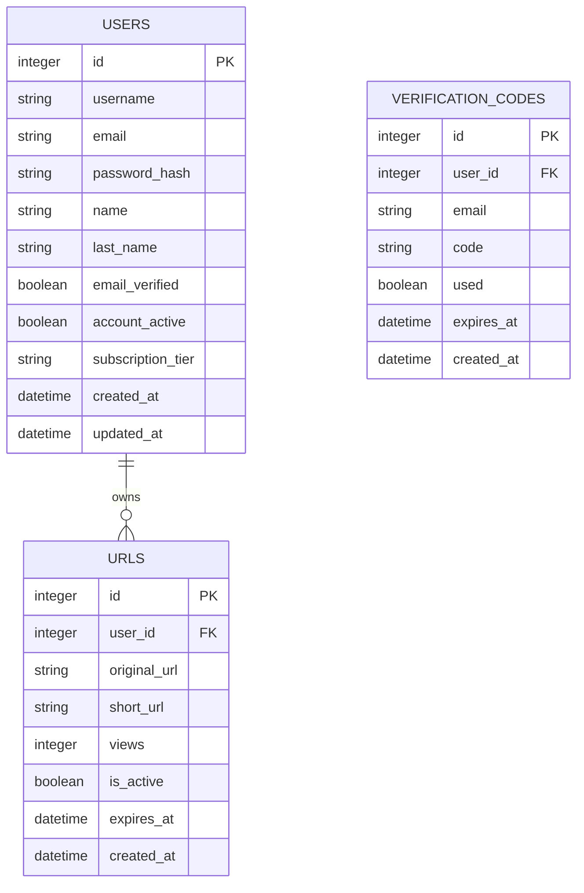

# 🏗️ ERDL URL Shortener - Architecture Overview

This document describes the current architecture of the ERDL URL Shortener backend, based on the live codebase (ignoring planned refactors).

---

## 📐 Architectural Patterns
### Repository Pattern
The project uses the Repository Pattern to abstract database access:
- **Responsibility**: Separates data access logic from business logic
- **Implementation**: `src/repository/` contains repository classes that handle all LibSQL queries
- **Benefit**: Controllers and services don't need to know database implementation details

### Controller-Service-Repository Layering
Requests flow through three layers:
1. **Routers** (`src/routers/`): Define API endpoints and HTTP methods
2. **Controllers** (`src/controllers/`): Handle HTTP requests, input validation, and response formatting
3. **Repositories** (`src/repository/`): Execute database queries and return data
4. **Services** (`src/services/`): Contain business logic (e.g., email sending)

---

## 🆔 Short URL ID Generation
The project uses `nanoid` to generate unique short identifiers:
- **Default Length**: 8 characters
- **Character Set**: URL-safe alphanumeric (`A-Za-z0-9`)
- **Implementation**: `src/utils/nanoidTool.ts` exports `generateShortId()`
- **Benefit**: Compact, collision-resistant, no external ID generation service required

---

## 🗄️ Database Schema
The project uses **LibSQL** (SQLite-compatible) with two configurations:
- **Development**: Local file-based SQLite at `src/Database/databases.db`
- **Production**: Turso managed LibSQL instance

### Core Tables (from `src/Database/sheme.sql`):

### Database Configuration
- **Connection**: Initialized in `src/Database/databases.ts` using `@libsql/client`
- **WAL Mode**: Enabled for better concurrent read/write performance
- **Indexes**: Applied on `short_url` (URL lookups) and `user_id` (user-specific queries)

---

## 🔐 Authentication Flow
1. **Registration**: User submits email/password → password hashed with bcryptjs → user stored in DB → verification code sent via Nodemailer
2. **Email Verification**: User submits code → code validated against `VERIFICATION_CODES` → `email_verified` set to `true`
3. **Login**: User submits credentials → password compared → JWT generated with `jsonwebtoken` → JWT stored in HttpOnly cookie `authTokenAuthorized`
4. **Protected Routes**: `src/Middleware/authJWT.ts` validates JWT from cookie → attaches user to request object

---

## 🛡️ Security Middleware
Configured in `src/main.ts`:
- **Helmet**: Sets secure HTTP headers (CSP, XSS protection, etc.)
- **CORS**: Restricts requests to `DOMAIN_FOR_FRONTEND` (configured in `src/config.ts`)
- **Cookie Parser**: Parses incoming cookies for JWT validation
- **Rate Limiting**: `express-rate-limit` prevents abuse of shortening endpoints

---

## 📊 Logging
- **Winston**: Structured logging with environment-aware levels
- **Morgan**: HTTP request logging (disabled in production by default)
- **Configuration**: `src/utils/logger.ts` exports `log` and `logger` instances

---

## 📚 API Documentation
- **Swagger/OpenAPI 3.0**: Configured in `src/docs/swagger.ts`
- **Interactive Docs**: Available at `/api-docs` in development
- **Spec Generation**: Uses `swagger-jsdoc` to parse JSDoc comments from routers and controllers
