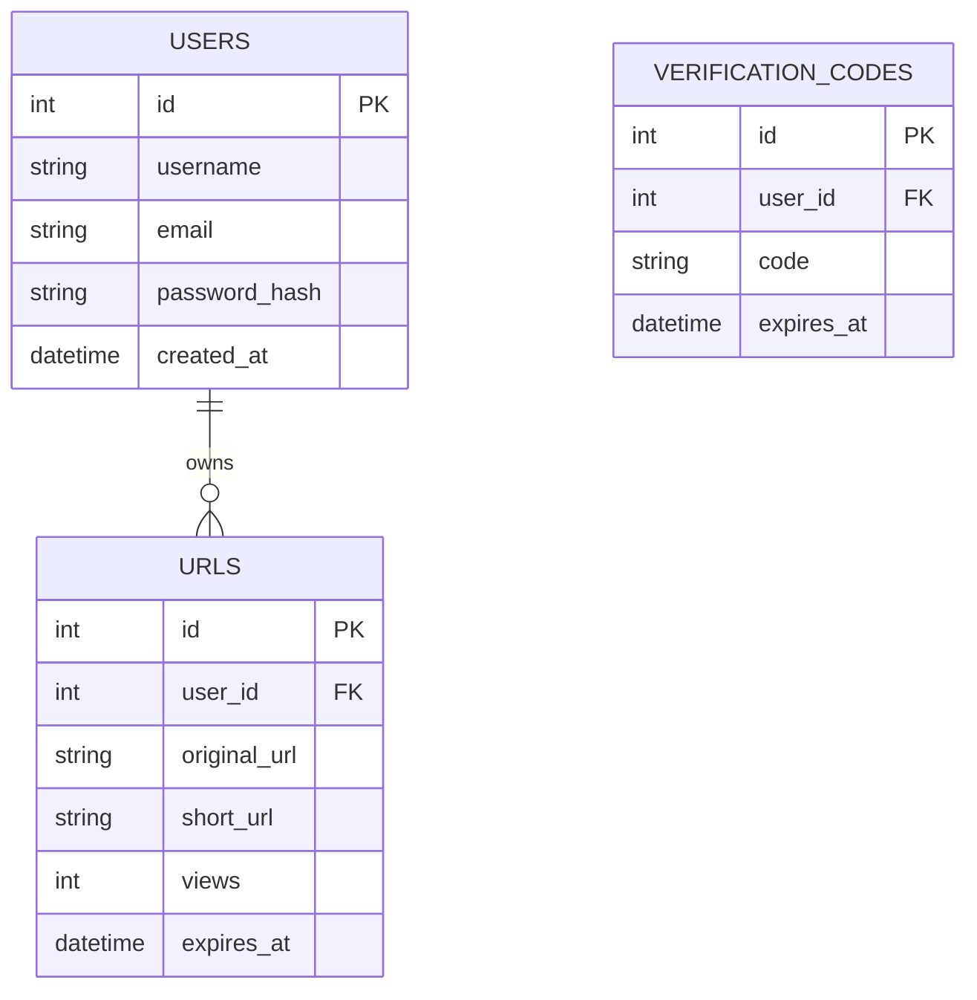

# 🏗️ Technical Architecture

This document provides a deep dive into the architectural decisions and data structures used in the **Shortener URL** project.

## 📐 Design Patterns

### Repository Pattern
The project uses the Repository Pattern to abstract the data access layer. This allows the business logic (Controllers) to interact with the data without knowing the specific database implementation details (LibSQL, Redis, etc.).
- **Interface**: `IUserRepository` defines the contract.
- **Implementation**: `UserRepository` implements the logic using `@libsql/client`.

### Controller Pattern
The `UserController` handles incoming HTTP requests, validates inputs, interacts with the repository, and returns formatted responses.

---

## 🆔 ID Generation (Snowflake)

We use a custom **Snowflake-like** ID generator to produce unique 64-bit integers.

### Structure of the ID:
- **Timestamp (41 bits)**: Milliseconds since Jan 1, 2024.
- **Machine ID (5 bits)**: Unique identifier for the worker node.
- **Sequence (5 bits)**: Incremental counter for IDs generated within the same millisecond.

### Why Snowflake?
- **Scalability**: Multiple machines can generate IDs simultaneously without a central authority.
- **Sortability**: IDs are roughly ordered by time.

### Why Base62?
After generating the numeric ID, we convert it to **Base62**. This reduces the length of the URL significantly (e.g., a 15-digit number becomes a 5-6 character string) using the character set `[0-9a-zA-Z]`.

---

## 🗄️ Database Schema

The database uses **LibSQL** (SQLite dialect). Below is a visualization of the core schema:

### Key Considerations:
- **Indexes**: There are indexes on `short_url` and `user_id` to ensure $O(1)$ or $O(\log n)$ lookup times.
- **Cleanup**: Triggers are used to automatically delete expired or used verification codes.

---

## 🏎️ Caching & Rate Limiting (Redis)

Redis is integrated to handle high-frequency tasks:
1.  **Rate Limiting**: Prevents abuse by limiting the number of URLs a user can shorten in a given period.
2.  **Redirect Caching**: (Planned) Store hot URL mappings in memory to reduce database load.
