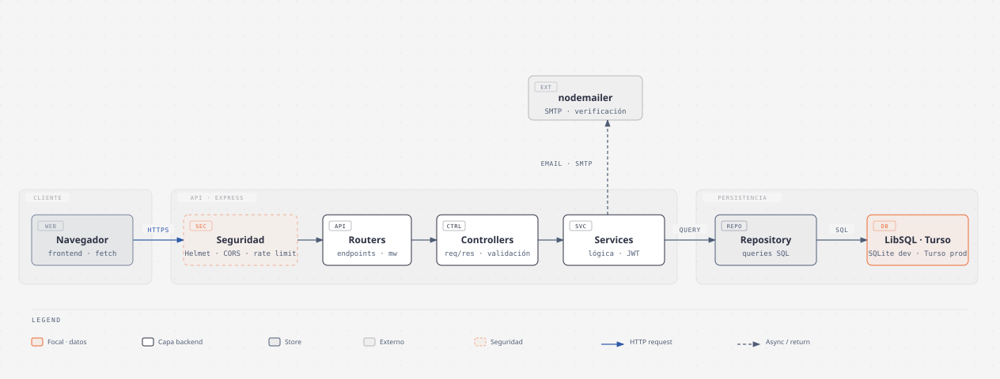
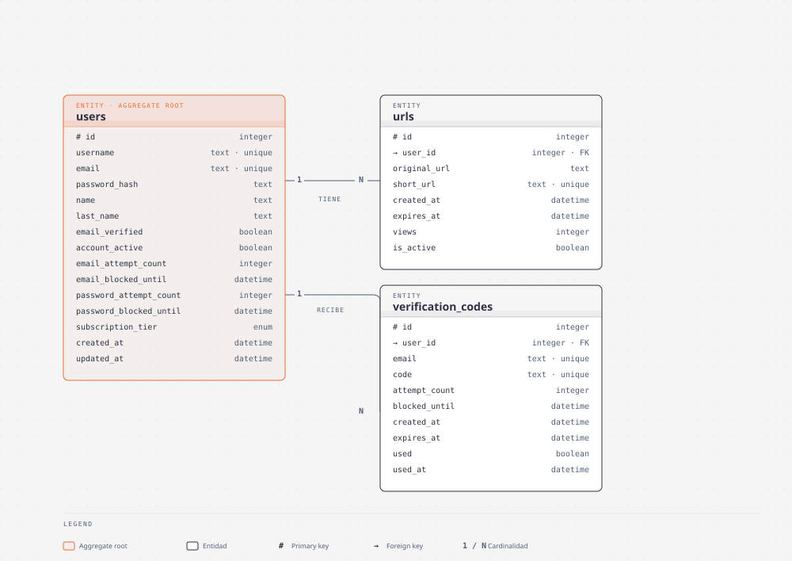
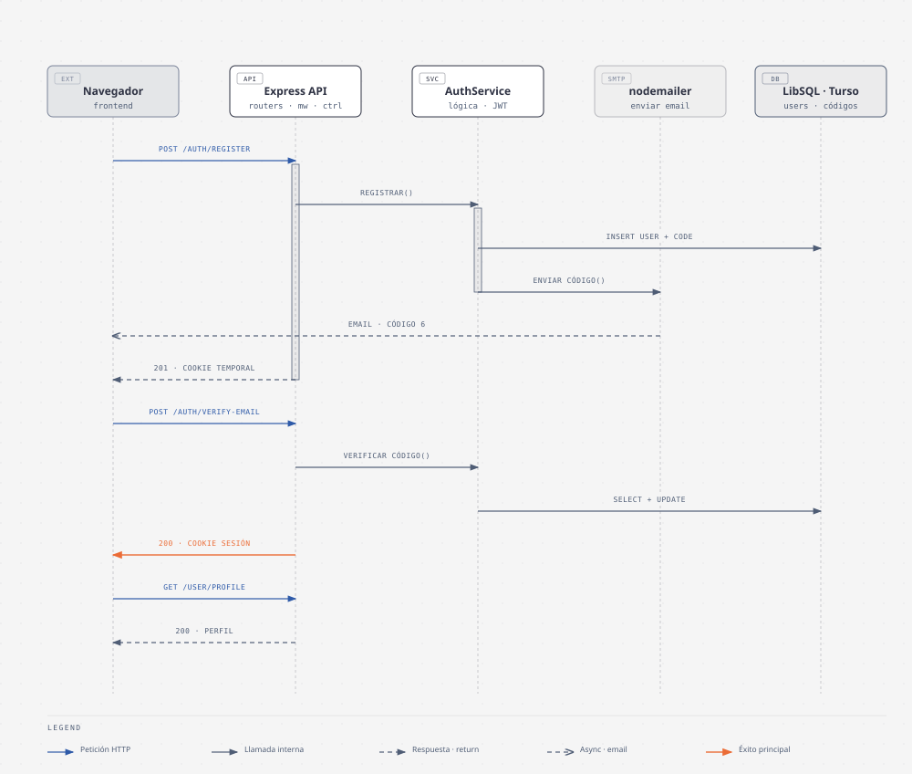

# Arquitectura del sistema


> Documentación técnica de la arquitectura del backend de **ERDL URL Shortener**, basada en el código fuente actual.

| Documentación | Contenido |
|---------------|-----------|
| [Guía de inicio rápido](GETTING_STARTED.md) | Instalación, variables de entorno y scripts |
| [Referencia de la API](API.md) | Endpoints, cuerpos y formatos de respuesta |
| [Seguridad](SECURITY.md) | JWT, cookies, rate limiting, anti-SSRF |
| [Testing](TESTING.md) | Suite de tests y tests de estrés |

---

## Visión general

El sistema sigue el flujo **Router → Controller → Service → Repository → LibSQL**, atravesando middlewares de seguridad en cada petición:



- **Cliente** → **API Express** atravesando middlewares de seguridad (Helmet, CORS, rate limiting)
- **Routers** → **Controllers** → **Services** → **Repository** → **LibSQL**
- **Nodemailer** envía los códigos de verificación por SMTP
- Versión interactiva ([abrir en el navegador](diagrams/architecture.html))

---

## Patrones arquitectónicos

### Repository Pattern

El proyecto separa el acceso a datos de la lógica de negocio:

- **Repositorios** (`src/repository/`): encapsulan todas las consultas SQL a LibSQL
- **Interfaces** (`src/models/types.ts`): definen contratos (`IUrlRepository`, `IAuthRepository`)
- **Beneficio**: controllers y services no conocen los detalles de implementación de la base de datos

### Controller-Service-Repository (capas)

```
Ruta (Router) → Controller → Service → Repository → Base de datos
```

1. **Routers** (`src/routers/`): definen endpoints, HTTP methods y rate limiting
2. **Controllers** (`src/controllers/`): manejan HTTP (request/response) y validación de entrada
3. **Services** (`src/services/`): lógica de negocio (validaciones, reglas, orquestación)
4. **Repositories** (`src/repository/`): ejecutan queries SQL y retornan datos

Cada router instancia su propia cadena de dependencias:

```typescript
// src/routers/usersRouters.ts
const urlRepository = new UrlRepository(turso);
const urlService = new UrlService(urlRepository);
const urlController = new UrlController(urlService);

router.get("/:shortUrl", url_Short, urlController.redirectShortController);
router.post("/api/v1/short", redirectShort, urlController.shortenerController);

// src/routers/userAuthRouter.ts
const authRepository = new AuthRepository(turso);
const authService = new AuthService(authRepository);
const authController = new AuthController(authService);
```

---

## Generación de IDs

| Aspecto | Detalle |
|---------|---------|
| **Herramienta** | `nanoid` (`src/utils/nanoidTool.ts`) |
| **Longitud** | 8 caracteres por defecto |
| **Conjunto de caracteres** | Alfanumérico URL-safe (`A-Za-z0-9`) |
| **Colisiones** | Estadísticamente despreciable con 8 caracteres |

---

## Generación de códigos de verificación

| Aspecto | Detalle |
|---------|---------|
| **Herramienta** | `crypto.randomBytes` (`src/utils/codeValidatedEmail.ts`) |
| **Longitud** | 6 caracteres por defecto |
| **Conjunto** | `A-Za-z0-9` |
| **Expiración** | 10 minutos (definido en la query SQL) |
| **Limpieza automática** | Triggers eliminan códigos expirados y usados |

---

## Base de datos

### Motor

**LibSQL** (compatible con SQLite) con dos configuraciones:

- **Desarrollo** — archivo local `src/Database/databases.db` (ruta `file:<cwd>/src/Database/databases.db`)
- **Producción** — instancia Turso con URL y token de autenticación

La conexión se inicializa en `src/Database/databases.ts` con `@libsql/client`.

### Esquema

```sql
-- Tabla de usuarios
CREATE TABLE IF NOT EXISTS users (
    id INTEGER PRIMARY KEY AUTOINCREMENT,
    username TEXT UNIQUE NOT NULL,
    email TEXT UNIQUE NOT NULL,
    password_hash TEXT NOT NULL,
    name TEXT,
    last_name TEXT,
    email_verified BOOLEAN DEFAULT 0,
    account_active BOOLEAN DEFAULT 1,
    email_attempt_count INTEGER DEFAULT 0,
    email_blocked_until DATETIME,
    password_attempt_count INTEGER DEFAULT 0,
    password_blocked_until DATETIME,
    subscription_tier TEXT DEFAULT 'free' CHECK(subscription_tier IN ('free', 'pro', 'premium')),
    created_at DATETIME DEFAULT CURRENT_TIMESTAMP,
    updated_at DATETIME DEFAULT CURRENT_TIMESTAMP
);

-- Tabla de URLs acortadas
CREATE TABLE IF NOT EXISTS urls (
    id INTEGER PRIMARY KEY AUTOINCREMENT,
    user_id INTEGER,
    original_url TEXT NOT NULL,
    short_url TEXT UNIQUE NOT NULL,
    created_at DATETIME DEFAULT CURRENT_TIMESTAMP,
    expires_at DATETIME,
    views INTEGER DEFAULT 0,
    is_active BOOLEAN DEFAULT 1,
    FOREIGN KEY (user_id) REFERENCES users(id) ON DELETE CASCADE
);

-- Tabla de códigos de verificación
CREATE TABLE IF NOT EXISTS verification_codes (
    id INTEGER PRIMARY KEY AUTOINCREMENT,
    user_id INTEGER,
    email TEXT UNIQUE,
    code TEXT UNIQUE,
    attempt_count INTEGER DEFAULT 0,
    blocked_until DATETIME,
    created_at DATETIME DEFAULT CURRENT_TIMESTAMP,
    expires_at DATETIME DEFAULT (DATETIME('now', '+10 minutes')),
    used BOOLEAN DEFAULT 0,
    used_at DATETIME,
    FOREIGN KEY (user_id) REFERENCES users(id) ON DELETE CASCADE
);
```

### Diagrama ER



Fuente editable: [`er-model.html`](diagrams/er-model.html) *(abre en el navegador)*.

### Índices

```sql
CREATE INDEX IF NOT EXISTS idx_urls_user_id ON urls(user_id);
CREATE INDEX IF NOT EXISTS idx_urls_short_url ON urls(short_url);
CREATE INDEX IF NOT EXISTS idx_urls_created_at ON urls(created_at);
CREATE INDEX IF NOT EXISTS idx_urls_is_active ON urls(is_active);
CREATE INDEX IF NOT EXISTS idx_verification_email ON verification_codes(email);
CREATE INDEX IF NOT EXISTS idx_verification_expires ON verification_codes(expires_at);
CREATE INDEX IF NOT EXISTS idx_verification_used ON verification_codes(used);
```

### Triggers

| Trigger | Comportamiento |
|---------|----------------|
| `delete_expired_verification_codes` | Elimina códigos expirados después de cada inserción |
| `delete_used_verification_codes` | Elimina el código inmediatamente después de marcarlo como usado |

---

## Flujo de autenticación

El sistema implementa un proceso de **3 pasos** con verificación de email por código:



### Paso 1 · Registro o Login

**Registro** (`POST /api/v1/auth/register`):

1. Valida datos (formato de email, contraseña ≥12 chars con requisitos, username ≥3 chars)
2. Verifica si el email está bloqueado (5 intentos máximos → 2 h de bloqueo)
3. Verifica que el email no exista
4. Hashea la contraseña con bcryptjs (10 rounds)
5. Crea el usuario en la tabla `users`
6. Genera código de verificación de 6 caracteres
7. Guarda el código en `verification_codes` (expira en 10 minutos)
8. Envía el email con el código
9. Establece la cookie `emailSendToVerifyUser` (JWT temporal, 2 minutos)

**Login** (`POST /api/v1/auth/login`):

1. Valida email y contraseña
2. Verifica bloqueos de email y contraseña
3. Compara la contraseña con bcryptjs
4. Verifica si hay un código de verificación activo (si existe → error 429 con tiempo restante)
5. Genera un nuevo código de verificación
6. Envía el email con el código
7. Establece la cookie `emailSendToVerifyUser` (JWT temporal, 2 minutos)
8. Retorna los datos del usuario

### Paso 2 · Verificación del código

**Verificar email** (`POST /api/v1/auth/verify-email`):

1. El middleware `verifySendToEmail` valida la cookie `emailSendToVerifyUser` y que el email del body coincida con el token
2. Valida que el email y el código estén presentes
3. Verifica bloqueos de código (5 intentos máximos → 1 h de bloqueo)
4. Consulta el usuario por email
5. Valida el código contra `verification_codes` (no usado, no expirado)
6. Marca el código como usado (el trigger lo elimina automáticamente)
7. Marca `email_verified = 1` en el usuario
8. Establece la cookie `authTokenAuthorized` (JWT de sesión, 2 días)

### Paso 3 · Rutas protegidas

Middleware `authJWT` en `src/middleware/authJWT.ts`:

1. Extrae la cookie `authTokenAuthorized`
2. Si no existe → `401`
3. Verifica el JWT con `jsonwebtoken`
4. Extrae `userEmail` del payload y lo inyecta en `req.userEmail`
5. Si el token está expirado → `401`; si la firma es inválida → `403`

> **Nota:** la referencia HTTP completa (cuerpos de solicitud y respuestas) está en la [Referencia de la API](API.md).

---

## Flujo de acortado y redirección de URLs

El proceso cubre ambas operaciones del servicio: acortar (`POST /api/v1/short`) y redirigir (`GET /:shortUrl`):


### Acortar (`POST /api/v1/short`)

1. **Validar anti-SSRF** → `validateDomain` comprueba protocolo, hostname, IPs privadas y TLD (ver [Seguridad](SECURITY.md#validación-de-urls-anti-ssrf))
2. **Generar código** → `nanoid(8)` alfanumérico URL-safe
3. **Guardar** → `UrlRepository` inserta la fila en `urls` vía LibSQL
4. **Responder** → `200` con la URL acortada `http://localhost:3000/abc12345`

### Redirigir (`GET /:shortUrl`)

1. **Buscar** → `UrlRepository` consulta `urls` por `short_url` con `is_active = 1`
2. **Redirigir** → si existe, `302` con `Location: original_url`; si no, `404`

---

## Manejo de errores

### AppError (`src/utils/AppError.ts`)

```typescript
class AppError extends Error {
    statusCode: number;
    details?: unknown;
}
```

Los services lanzan `AppError` con el código de estado y mensaje apropiado. El middleware `errorHandler` los captura y retorna la respuesta JSON correspondiente.

### Respuestas de error

| Tipo | Formato |
|------|---------|
| `AppError` | `{ message: "..." }` o `{ message: "...", details: {...} }` |
| Ruta no encontrada | `{ error: "Not Found", message: "Ruta METHOD /path no encontrada" }` |
| Error no controlado | `{ error: "Internal Server Error", message: "Ocurrió un error inesperado" }` |

> **Nota:** el detalle de los formatos y códigos de estado está en la [Referencia de la API](API.md).

---

## Logging

### Winston (`src/utils/logger.ts`)

| Modo | Formato | Transportes |
|------|---------|------------|
| Desarrollo | Colorizado, legible, con timestamp | Console + `logs/error.log` + `logs/combined.log` |
| Producción | JSON estructurado, con timestamp | `logs/error.log` + `logs/combined.log` |

- **Nivel**: `debug` en desarrollo, `info` en producción
- **Archivos**: rotación automática, máximo 5 MB por archivo, máximo 5 archivos
- **Silenciado en stress test**: los archivos de log se deshabilitan con `STRESS_TEST=true`
- **Exportaciones**: `logger` (winston completo) y `log` (atajo con métodos `info`, `warn`, `error`, `debug`)

### Morgan

- Habilitado solo en desarrollo (no en producción)
- Se omite si `SKIP_LOGS=true`
- Formato `dev`

---

## Validación de datos de usuario

### Email (`validateEmail`)

- Formato regex estándar RFC 5322 simplificado
- Máximo 254 caracteres totales
- Parte local máxima de 64 caracteres
- Sin puntos consecutivos, sin puntos al inicio/final de la parte local

### Registro (`validateRegistration`)

- Username ≥3 caracteres (si se proporciona)
- Email válido (usa `validateEmail`)
- Contraseña válida (usa `validatePassword` — ver [Seguridad](SECURITY.md#política-de-contraseñas-validatepassword))
- Nombre/apellido ≥2 caracteres (si se proporciona)

---

## Inicialización del servidor

### Punto de entrada (`src/run.ts`)

1. Importa `app` desde `src/main.ts`
2. Escucha en el puerto configurado
3. Registra manejadores para:
   - `unhandledRejection` → log del error
   - `uncaughtException` → log del error + `process.exit(1)`
   - `SIGINT` → cierre graceful del servidor

### Express (`src/main.ts`)

1. Crea la aplicación Express
2. Configura middlewares globales (CORS, Helmet, Cookie Parser, JSON, URL-encoded)
3. Habilita Morgan en desarrollo
4. Monta las 3 rutas:
   - `usersRouter` (raíz `/` para `/:shortUrl` y `/api/v1/short`)
   - `userAuthRouter` (`/api/v1/`)
   - `protectedRoutes` (`/api/v1/`)
5. Registra `notFoundHandler` y `errorHandler`

---

## Siguientes pasos

- [Guía de inicio rápido](GETTING_STARTED.md) — instalación y variables de entorno
- [Referencia de la API](API.md) — endpoints, cuerpos y formatos de respuesta
- [Seguridad](SECURITY.md) — mecanismos de protección implementados
- [Testing](TESTING.md) — suite de tests y tests de estrés