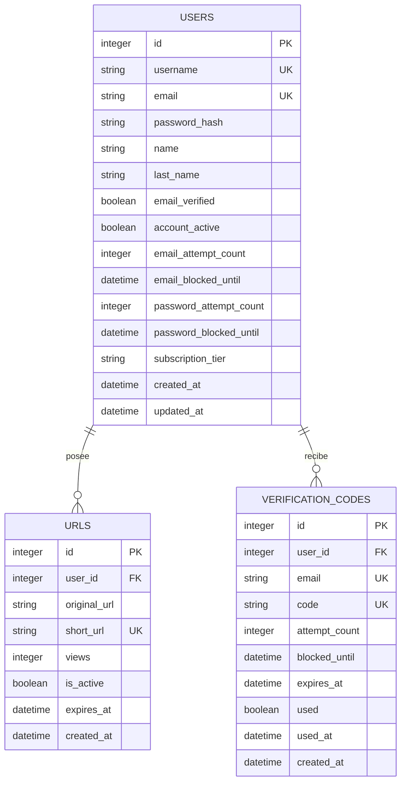

# Arquitectura del Proyecto

Documentación técnica de la arquitectura del backend de ERDL URL Shortener, basada en el código fuente actual.

---

## Patrones arquitectónicos

### Repository Pattern

El proyecto separa el acceso a datos de la lógica de negocio mediante el Repository Pattern:

- **Repositorios** (`src/repository/`): encapsulan todas las consultas SQL a LibSQL
- **Interfaces** (`src/models/types.ts`): definen contratos (`IUrlRepository`, `IAuthRepository`)
- **Beneficio**: controllers y services no conocen los detalles de implementación de la base de datos

### Controller-Service-Repository (capas)

```
Ruta (Router) → Controller → Service → Repository → Base de datos
```

1. **Routers** (`src/routers/`): definen endpoints, HTTP methods y rate limiting
2. **Controllers** (`src/controllers/`): manejan HTTP (request/response), validación de entrada
3. **Services** (`src/services/`): lógica de negocio (validaciones, reglas, orquestación)
4. **Repositories** (`src/repository/`): ejecutan queries SQL y retornan datos

Cada router instancia su propia cadena de dependencias:

```typescript
// src/routers/usersRouters.ts
const urlRepository = new UrlRepository(turso);
const urlService = new UrlService(urlRepository);
const urlController = new UrlController(urlService);

router.get("/:shortUrl", url_Short, urlController.redirectShortController);
router.post("/api/v1/short", redirectShort, urlController.shortenerController);

// src/routers/userAuthRouter.ts
const authRepository = new AuthRepository(turso);
const authService = new AuthService(authRepository);
const authController = new AuthController(authService);
```

---

## Generación de IDs

- **Herramienta**: `nanoid` (src/utils/nanoidTool.ts)
- **Longitud**: 8 caracteres por defecto
- **Conjunto de caracteres**: alfanumérico URL-safe (`A-Za-z0-9`)
- **Colisiones**: estadísticamente despreciable con 8 caracteres

---

## Generación de códigos de verificación

- **Herramienta**: `crypto.randomBytes` (src/utils/codeValidatedEmail.ts)
- **Longitud**: 6 caracteres por defecto
- **Conjunto**: `A-Za-z0-9`
- **Expiración**: 10 minutos (definido en la query SQL)
- **Limpieza automática**: triggers eliminan códigos expirados y usados

---

## Base de datos

### Motor

**LibSQL** (compatible con SQLite) con dos configuraciones:

- **Desarrollo**: archivo local `src/Database/databases.db` (ruta: `file:<cwd>/src/Database/databases.db`)
- **Producción**: instancia Turso con URL y token de autenticación

Conexión inicializada en `src/Database/databases.ts` con `@libsql/client`.

### Esquema

```sql
-- Tabla de usuarios
CREATE TABLE IF NOT EXISTS users (
    id INTEGER PRIMARY KEY AUTOINCREMENT,
    username TEXT UNIQUE NOT NULL,
    email TEXT UNIQUE NOT NULL,
    password_hash TEXT NOT NULL,
    name TEXT,
    last_name TEXT,
    email_verified BOOLEAN DEFAULT 0,
    account_active BOOLEAN DEFAULT 1,
    email_attempt_count INTEGER DEFAULT 0,
    email_blocked_until DATETIME,
    password_attempt_count INTEGER DEFAULT 0,
    password_blocked_until DATETIME,
    subscription_tier TEXT DEFAULT 'free' CHECK(subscription_tier IN ('free', 'pro', 'premium')),
    created_at DATETIME DEFAULT CURRENT_TIMESTAMP,
    updated_at DATETIME DEFAULT CURRENT_TIMESTAMP
);

-- Tabla de URLs acortadas
CREATE TABLE IF NOT EXISTS urls (
    id INTEGER PRIMARY KEY AUTOINCREMENT,
    user_id INTEGER,
    original_url TEXT NOT NULL,
    short_url TEXT UNIQUE NOT NULL,
    created_at DATETIME DEFAULT CURRENT_TIMESTAMP,
    expires_at DATETIME,
    views INTEGER DEFAULT 0,
    is_active BOOLEAN DEFAULT 1,
    FOREIGN KEY (user_id) REFERENCES users(id) ON DELETE CASCADE
);

-- Tabla de códigos de verificación
CREATE TABLE IF NOT EXISTS verification_codes (
    id INTEGER PRIMARY KEY AUTOINCREMENT,
    user_id INTEGER,
    email TEXT UNIQUE,
    code TEXT UNIQUE,
    attempt_count INTEGER DEFAULT 0,
    blocked_until DATETIME,
    created_at DATETIME DEFAULT CURRENT_TIMESTAMP,
    expires_at DATETIME DEFAULT (DATETIME('now', '+10 minutes')),
    used BOOLEAN DEFAULT 0,
    used_at DATETIME,
    FOREIGN KEY (user_id) REFERENCES users(id) ON DELETE CASCADE
);
```

### Diagrama ER



### Índices

```sql
CREATE INDEX IF NOT EXISTS idx_urls_user_id ON urls(user_id);
CREATE INDEX IF NOT EXISTS idx_urls_short_url ON urls(short_url);
CREATE INDEX IF NOT EXISTS idx_urls_created_at ON urls(created_at);
CREATE INDEX IF NOT EXISTS idx_urls_is_active ON urls(is_active);
CREATE INDEX IF NOT EXISTS idx_verification_email ON verification_codes(email);
CREATE INDEX IF NOT EXISTS idx_verification_expires ON verification_codes(expires_at);
CREATE INDEX IF NOT EXISTS idx_verification_used ON verification_codes(used);
```

### Triggers

- **`delete_expired_verification_codes`**: elimina códigos expirados después de cada inserción
- **`delete_used_verification_codes`**: elimina el código inmediatamente después de marcarlo como usado

---

## Flujo de autenticación

El sistema implementa un proceso de 3 pasos con verificación de email por código:

### Paso 1: Registro o Login

**Registro** (`POST /api/v1/auth/register`):
1. Valida datos (email formato, contraseña ≥12 chars con requisitos, username ≥3 chars)
2. Verifica si el email está bloqueado (5 intentos máximos → 2 h de bloqueo)
3. Verifica que el email no exista
4. Hashea la contraseña con bcryptjs (10 rounds)
5. Crea el usuario en la tabla `users`
6. Genera código de verificación de 6 caracteres
7. Guarda el código en `verification_codes` (expira en 10 minutos)
8. Envía email con el código
9. Establece cookie `emailSendToVerifyUser` (JWT temporal, 2 minutos)

**Login** (`POST /api/v1/auth/login`):
1. Valida email y contraseña
2. Verifica bloqueos de email y contraseña
3. Compara contraseña con bcryptjs
4. Verifica si hay un código de verificación activo (si existe → error 429 con tiempo restante)
5. Genera nuevo código de verificación
6. Envía email con el código
7. Establece cookie `emailSendToVerifyUser` (JWT temporal, 2 minutos)
8. Retorna datos del usuario

### Paso 2: Verificación del código

**Verificar email** (`POST /api/v1/auth/verify-email`):
1. Middleware `verifySendToEmail` valida la cookie `emailSendToVerifyUser` y que el email del body coincida con el token
2. Valida que el email y código estén presentes
3. Verifica bloqueos de código (5 intentos máximos → 1 h de bloqueo)
4. Consulta el usuario por email
5. Valida el código contra `verification_codes` (no usado, no expirado)
6. Marca el código como usado (trigger lo elimina automáticamente)
7. Marca `email_verified = 1` en el usuario
8. Establece cookie `authTokenAuthorized` (JWT de sesión, 2 días)

### Paso 3: Rutas protegidas

Middleware `authJWT` en `src/Middleware/authJWT.ts`:
1. Extrae la cookie `authTokenAuthorized`
2. Si no existe → 401
3. Verifica el JWT con `jsonwebtoken`
4. Extrae `userEmail` del payload y lo inyecta en `req.userEmail`
5. Si el token está expirado → 401; si la firma es inválida → 403

---

## JWT

Dos tipos de token, ambos firmados con `JWT_SECRET`:

| Token | Función | Expiración | Payload |
|-------|---------|------------|---------|
| `emailValidJWToken` | Temporal para verificación de email | 2 minutos | `{ userEmail }` |
| `userAuthJWToken` | Sesión de autenticación | 2 días | `{ userEmail }` |

---

## Cookies

| Cookie | Contenido | Duración | HttpOnly | Secure | SameSite |
|--------|-----------|----------|----------|--------|----------|
| `emailSendToVerifyUser` | JSON `{ token: <JWT temporal> }` | 2 minutos | Sí | Sí (prod) | lax |
| `authTokenAuthorized` | JWT de sesión | Configurable (default 7 días) | Sí | Sí (prod) | lax |

Configuración base en `src/config.ts` → `configCookiesParams`:
- `httpOnly`: `true` (a menos que `HTTP_ONLY=false`)
- `secure`: `true` solo en producción (`NODE_ENV=production`)
- `sameSite`: `lax` por defecto
- `path`: `/`

---

## Límite de intentos (attemptLimiter)

Configurado en `src/utils/attemptLimiter.ts`:

| Scope | Tabla | Columna de intentos | Columna de bloqueo | Intentos máximos | Bloqueo |
|-------|-------|---------------------|--------------------|-----------------|---------|
| `email` | `users` | `email_attempt_count` | `email_blocked_until` | 5 | 2 horas |
| `password` | `users` | `password_attempt_count` | `password_blocked_until` | 5 | 2 horas |
| `code` | `verification_codes` | `attempt_count` | `blocked_until` | 5 | 1 hora |

**Comportamiento**: al alcanzar 5 intentos, se resetea el contador y se establece la fecha de bloqueo. Las operaciones `checkBlocked`, `registerAttempt` y `resetAttempts` están implementadas en `AuthRepository`.

---

## Rate limiting

Configurado en `src/utils/limitClick.ts` usando `express-rate-limit`:

| Endpoint | Ventana | Límite (producción) | Límite (desarrollo) | Alias en código |
|----------|---------|---------------------|---------------------|-----------------|
| `POST /api/v1/short` | 1 hora | 5.000 | 1.000.000 | `redirectShort` |
| `GET /:shortUrl` | 1 hora | 50.000 | 1.000.000 | `url_Short` |
| Auth (register, login, verify-email) | 24 horas | 4 | 2.000 | `limitAuthButton` |

- En modo stress test (`STRESS_TEST=true`), los rate limits de URLs se deshabilitan
- Se usa `ipKeyGenerator` de `express-rate-limit` como generador de claves

---

## Middleware de seguridad

Configurados en `src/main.ts`:

| Middleware | Función |
|-----------|---------|
| **Helmet** | Cabeceras HTTP seguras (CSP y cross-origin solo en producción) |
| **CORS** | Origen restringido a `DOMAIN_FOR_FRONTEND` con `credentials: true` |
| **Cookie Parser** | Parseo de cookies para validación JWT |
| **express.json** | Parseo de cuerpos JSON |
| **express.urlencoded** | Parseo de cuerpos URL-encoded |
| **Morgan** | Logging HTTP en desarrollo (se omite con `SKIP_LOGS=true`) |
| **notFoundHandler** | Captura rutas inexistentes (404) |
| **errorHandler** | Manejo centralizado de errores (AppError → respuesta consistente) |

Middleware específicos de rutas:

- **`limitAuthButton`**: rate limiting en endpoints de auth
- **`redirectShort`** / **`url_Short`**: rate limiting en endpoints de URLs
- **`authJWT`**: validación de JWT en rutas protegidas
- **`verifySendToEmail`**: validación de cookie temporal de verificación

---

## Validación de URLs (anti-SSRF)

Función `validateDomain` en `src/utils/validateUserData.ts`:

1. **Formato**: debe ser string no vacío, ≤2048 caracteres
2. **Caracteres**: sin espacios, sin caracteres de control, sin barras invertidas
3. **Parsing**: debe ser una URL válida (constructor `URL`)
4. **Protocolo**: solo `http:` o `https:`
5. **Hostname**: obligatorio
6. **Credenciales**: no se permiten (`user:password@`)
7. **Longitud del hostname**: ≤253 caracteres
8. **IPs privadas**: detecta IPv4 (10.x, 172.16-31.x, 192.168.x, loopback, CGNAT, multicast) y IPv6 (loopback, ULA, link-local, IPv4-mapped)
9. **Hosts locales**: rechaza `localhost`, `*.localhost`, `*.local`, `*.internal`
10. **IPs literales**: rechaza direcciones IP en formato numérico o hexadecimal
11. **Formato del dominio**: solo alfanumérico, guiones, puntos; sin `..`
12. **Labels del dominio**: ≤63 caracteres, sin guiones al inicio/final
13. **TLD**: ≥2 letras

---

## Manejo de errores

### AppError (`src/utils/AppError.ts`)

```typescript
class AppError extends Error {
    statusCode: number;
    details?: unknown;
}
```

Los services lanzan `AppError` con el código de estado y mensaje apropiado. El middleware `errorHandler` los captura y retorna la respuesta JSON correspondiente.

### Respuestas de error

| Tipo | Formato |
|------|---------|
| `AppError` | `{ message: "..." }` o `{ message: "...", details: {...} }` |
| Ruta no encontrada | `{ error: "Not Found", message: "Ruta METHOD /path no encontrada" }` |
| Error no controlado | `{ error: "Internal Server Error", message: "Ocurrió un error inesperado" }` |

---

## Logging

### Winston (`src/utils/logger.ts`)

| Modo | Formato | Transportes |
|------|---------|------------|
| Desarrollo | Colorizado, legible, con timestamp | Console + `logs/error.log` + `logs/combined.log` |
| Producción | JSON estructurado, con timestamp | `logs/error.log` + `logs/combined.log` |

- **Nivel**: `debug` en desarrollo, `info` en producción
- **Archivos**: rotación automática, máximo 5 MB por archivo, máximo 5 archivos
- **Silenciado en stress test**: los archivos de log se deshabilitan con `STRESS_TEST=true`
- **Exportaciones**: `logger` (winston completo) y `log` (atajo con métodos `info`, `warn`, `error`, `debug`)

### Morgan

- Habilitado solo en desarrollo (no producción)
- Se omite si `SKIP_LOGS=true`
- Formato `dev`

---

## Validación de datos de usuario

### Email (`validateEmail`)
- Formato regex estándar RFC 5322 simplificado
- Máximo 254 caracteres totales
- Parte local máxima de 64 caracteres
- Sin puntos consecutivos, sin puntos al inicio/final de la parte local

### Contraseña (`validatePassword`)
- Mínimo 12 caracteres
- Al menos: 1 minúscula, 1 mayúscula, 1 número, 1 carácter especial
- Sin espacios
- Sin secuencias numéricas/alabéticas (123, abc, etc.)
- Fortaleza clasificada: débil (≤3), media (≤5), fuerte (≤10), muy fuerte (>10)

### Registro (`validateRegistration`)
- Username ≥3 caracteres (si se proporciona)
- Email válido (usa `validateEmail`)
- Contraseña válida (usa `validatePassword`)
- Nombre/apellido ≥2 caracteres (si se proporciona)

---

## Testing

### Configuración

- **Framework**: Jest con preset ESM (`ts-jest/presets/default-esm`)
- **Entorno**: Node.js
- **Setup**: `test/setup.ts` establece `NODE_ENV=test`, `JWT_SECRET` y `STRESS_TEST=true`
- **Cobertura**: habilitada, directorio `coverage/`
- **Module mapping**: `*.js` → extensión eliminada para compatibilidad ESM

### Estructura de tests

```
test/
├── setup.ts                          # Variables de entorno para tests
├── src/
│   ├── controllers/
│   │   ├── authController.test.ts
│   │   └── urlController.test.ts
│   ├── services/
│   │   ├── authService.test.ts
│   │   ├── urlService.test.ts
│   │   └── sendEmails.test.ts
│   ├── repository/
│   │   ├── urlRepository.test.ts
│   │   └── userAuthRepository.test.ts
│   ├── Middleware/
│   │   └── authJWT.test.ts
│   ├── middleware/
│   │   └── errorHandler.test.ts
│   └── utils/
│       ├── AppError.test.ts
│       ├── attemptLimiter.test.ts
│       ├── codeValidatedEmail.test.ts
│       ├── jwt.test.ts
│       ├── limitClick.test.ts
│       ├── nanoidTool.test.ts
│       ├── password_encrypt.test.ts
│       └── validateUserData.test.ts
└── stress/
    └── stress-tester.ts
```

### Tests de estrés

- **Herramienta**: autocannon
- **Configuración**: 500 conexiones, pipelining 1, 60 segundos
- **Flujo encadenado**: POST (crear URL con ID aleatorio) → GET (redirección)
- **Métricas**: peticiones totales/segundo, latencia promedio/máxima, distribución 2xx/3xx/4xx/5xx
- **Modos**: desarrollo (`npm run stress`) y producción (`npm run stress:full`)
- **En modo stress**: rate limits deshabilitados y logging a archivos silenciado

---

## Inicialización del servidor

### Punto de entrada (`src/run.ts`)

1. Importa `app` desde `src/main.ts`
2. Escucha en el puerto configurado
3. Registra manejadores para:
   - `unhandledRejection` → log del error
   - `uncaughtException` → log del error + `process.exit(1)`
   - `SIGINT` → cierre graceful del servidor

### Express (`src/main.ts`)

1. Crea la aplicación Express
2. Configura middlewares globales (CORS, Helmet, Cookie Parser, JSON, URL-encoded)
3. Habilita Morgan en desarrollo
4. Monta las 3 rutas:
   - `usersRouter` (raíz: `/` para `/:shortUrl` y `/api/v1/short`)
   - `userAuthRouter` (`/api/v1/`)
   - `protectedRoutes` (`/api/v1/`)
5. Registra `notFoundHandler` y `errorHandler`
